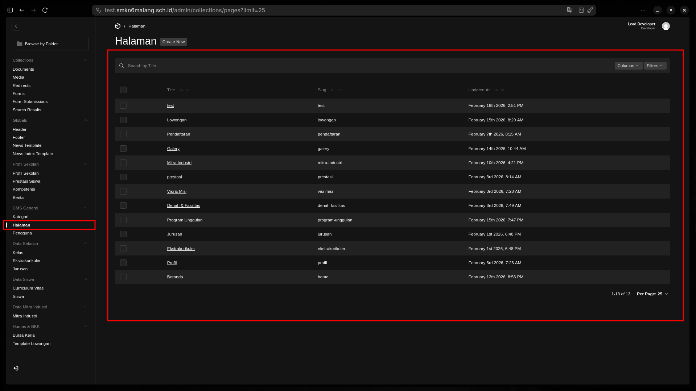

Sistem website SMKN 6 Malang menggunakan pendekatan **Block-Based Design**. Artinya, Anda tidak hanya menulis teks, tetapi menyusun "Puzzle" visual untuk membangun sebuah halaman yang menarik.

## 1. Konsep Dasar Page Builder

Setiap halaman dikelola melalui koleksi **Halaman** di bawah grup menu **CMS General**. Struktur halaman dibagi menjadi tiga zona utama:
1.  **Hero Section**: Bagian paling atas halaman (Header besar dengan gambar/video).
2.  **Layout Blocks**: Tubuh halaman yang terdiri dari berbagai pilihan komponen (Stats, News, Card Grid, dll).
3.  **SEO & Metadata**: Pengaturan bagaimana halaman ini muncul di Google.

:::tip[Visual Index Halaman]

*Gunakan fitur pencarian di pojok kanan atas untuk menemukan halaman spesifik seperti 'Beranda' atau 'Profil'.*
:::

## 2. Bedah Komponen Layout (Blocks)

Saat Anda menekan tombol **"Add Block"** di tab Content, Anda akan menemukan berbagai pilihan:

### **A. Stats Section (Statistik Sekolah)**
*   **Fungsi**: Menampilkan pencapaian angka (misal: Jumlah Siswa, Jumlah Guru, Luas Lahan).
*   **Teknis**: Masukkan label dan angka. Gunakan angka bulat agar animasi "Counter" berjalan mulus di frontend.

### **B. Collection Lists (Berita/Ekskul/Jurusan)**
*   **Logika**: Blok ini tidak meminta Anda menulis konten baru, melainkan "menarik" data yang sudah ada dari database.
*   **Tip**: Jika Anda memilih blok *News Collection List*, website akan otomatis menampilkan 3-4 berita terbaru tanpa Anda perlu mengupdate halaman ini secara manual.

### **C. Content & Media Blocks**
*   **Content**: Editor teks biasa untuk narasi panjang.
*   **Media Block**: Untuk menyisipkan gambar besar atau video YouTube (cukup masukkan link ID YouTube-nya).

## 3. Manajemen Hero (Header Halaman)

Tab **Hero** menentukan kesan pertama pengunjung.
*   **High Impact Hero**: Menampilkan gambar besar memenuhi layar dengan teks di tengah. Cocok untuk Beranda.
*   **Medium Impact**: Gambar lebih kecil, fokus pada judul halaman. Cocok untuk halaman informasi seperti "Visi Misi".
*   **Minimal Hero**: Hanya teks judul saja.

## 4. Alur Kerja & Preview

:::warning[Pentingnya Preview]
Karena Page Builder bersifat visual, selalu gunakan tombol **Preview** di pojok kanan atas sebelum melakukan melakukan **Publish Changes**. Pastikan susunan blok tidak terlalu rapat dan gambar yang digunakan tidak pecah.
:::

1.  **Susun Blok**: Tambah, hapus, atau tarik (Drag & Drop) untuk mengatur urutan.
2.  **Save Draft**: Simpan progres susunan Anda.
3.  **Live Preview**: Cek tampilan di HP dan Desktop.
4.  **Publish**: Tekan tombol hijau untuk menerapkan perubahan ke website publik.
