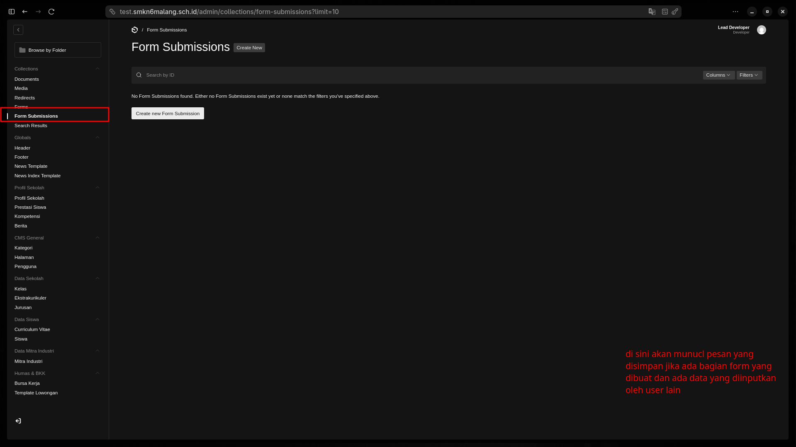

Saat masyarakat mengisi formulir "Hubungi Kami" di website, pesannya tidak hilang begitu saja. Anda bisa membacanya di sini.

:::tip[Area Gambar: List Pesan]

:::

## 1. Memilih Pesan
Setiap baris di daftar menunjukkan satu orang yang mengirim pesan. Klik pada salah satu baris untuk melihat isinya.

## 2. Detail Informasi
Anda bisa melihat:
*   **Nama Penduduk**: Siapa yang mengirim?
*   **Email/Kontak**: Untuk Anda hubungi balik jika perlu.
*   **Keperluan**: Topik pembicaraan mereka.
*   **Waktu Kirim**: Kapan pesan tersebut masuk.

:::danger[Privasi]
Jangan menyebarkan data pribadi (Email/No. HP) pengunjung kepada pihak yang tidak berkepentingan demi menjaga reputasi sekolah.
:::
