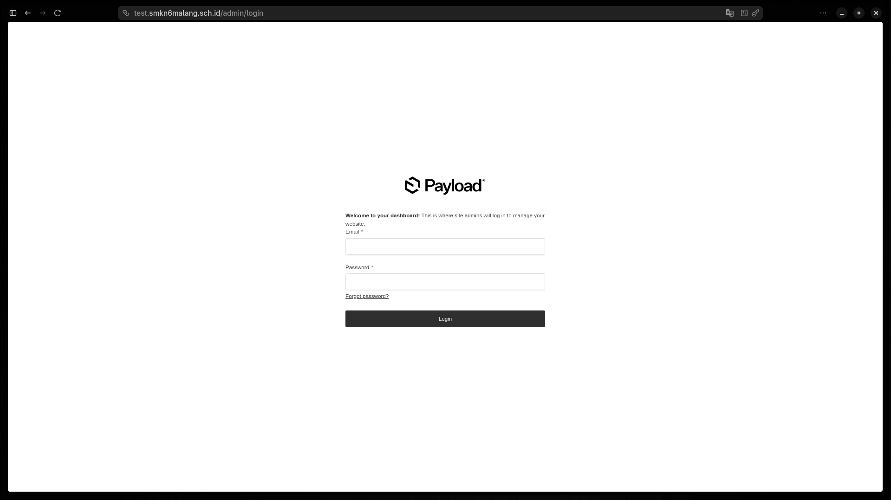
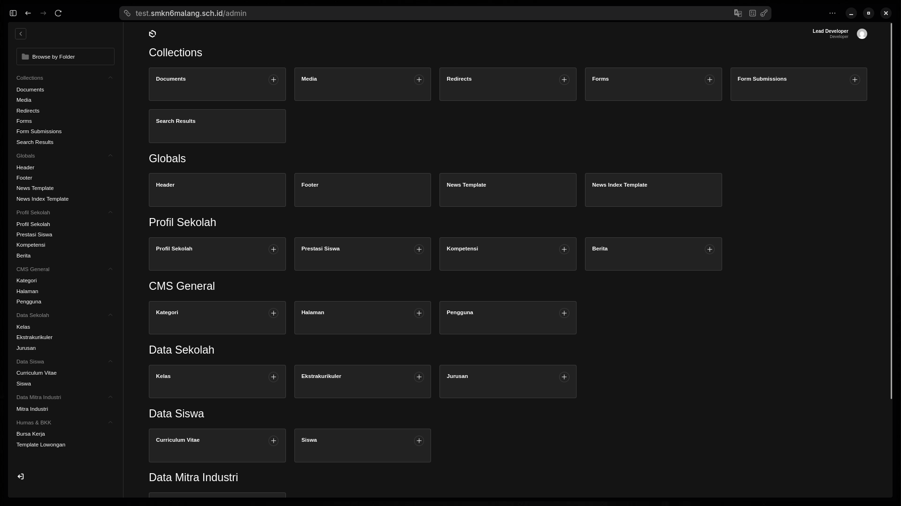

Selamat datang di panel kendali SMK Negeri 6 Malang. Halaman ini akan memandu Anda mengenal "peta" kerja di website ini.

:::tip[Area Gambar: Halaman Login]

*Masukkan email dan password yang telah diberikan oleh tim IT.*
:::

:::tip[Area Gambar: Dashboard Utama]

*Tampilan setelah berhasil masuk ke sistem.*
:::

## 1. Navigasi Sidebar (Sisi Kiri)

Sidebar adalah daftar menu utama Anda. Semua data sekolah dikelompokkan agar mudah ditemukan:

*   **Collections**: Daftar data yang isinya banyak (Database).
*   **Globals**: Pengaturan yang hanya ada satu (Contoh: Nama Website, Menu Header).
*   **Group Menu**: Kami mengelompokkan menu berdasarkan divisi (Siswa, Jurusan, Humas, dll).

## 2. Area Kartu (Dashboard Utama)

Di bagian tengah, Anda melihat kotak-kotak (Cards). Ini adalah "Jalan Pintas":
*   Klik nama kotak untuk **melihat daftar** (misal: "Berita").
*   Klik tanda **`+`** untuk **menambah data baru** secara instan.

## 3. Akun Pengguna (Sisi Kanan Atas)

Di sini Anda bisa:
*   Melihat User yang sedang login.
*   Mengubah Profil atau Password Anda sendiri.
*   Log Out (Keluar) dari sistem demi keamanan.

:::caution[Keamanan Penting]
Selalu pastikan Anda keluar (Log Out) jika sedang menggunakan komputer di tempat umum atau laboratorium sekolah agar data sekolah tidak disalahgunakan.
:::

## 5. Tips & Trik Navigasi Cepat

Agar pekerjaan Anda lebih efisien, gunakan pintasan berikut:

*   **Pencarian Cepat (`Ctrl + K`)**: Langsung ketik nama koleksi (misal: "Berita") untuk berpindah tanpa harus mencari di sidebar.
*   **Tombol `+` Instan**: Arahkan kursor ke nama menu di sidebar, lalu klik ikon plus yang muncul untuk langsung membuat data baru.
*   **Mode Gelap/Terang**: Klik ikon matahari/bulan di pojok kanan atas untuk menyesuaikan kenyamanan mata Anda saat bekerja.

:::note[Catatan Sistem]
Sistem ini menggunakan teknologi **Auto-Save** untuk draf, namun sangat disarankan untuk tetap menekan tombol **Save Draft** secara manual setiap kali Anda selesai menulis satu paragraf panjang.
:::
