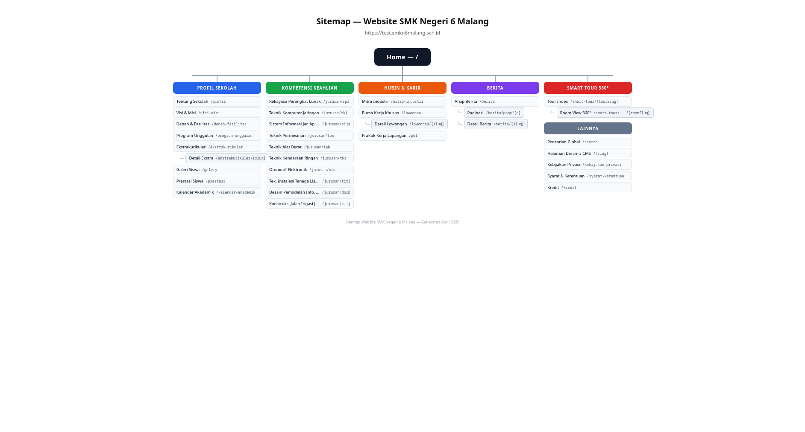

## Peta Navigasi Website

Website SMK Negeri 6 Malang memiliki **5 menu navigasi utama** yang masing-masing memiliki sub-halaman. Selain itu terdapat halaman khusus seperti **Smart Tour 360°** dan **Pencarian Global**.



---

### 📋 1. Profil Sekolah

Menu dropdown pertama yang berisi informasi umum sekolah.

| Halaman | URL | Deskripsi |
|---------|-----|-----------|
| Tentang Sekolah | `/profil` | Profil singkat, sejarah, dan identitas sekolah |
| Visi & Misi | `/visi-misi` | Arah tujuan dan nilai-nilai utama sekolah |
| Denah & Fasilitas | `/denah-fasilitas` | Lokasi gedung dan fasilitas penunjang belajar |
| Program Unggulan | `/program-unggulan` | Program khusus kompetensi dan daya saing siswa |
| Ekstrakurikuler | `/ekstrakurikuler` | Daftar kegiatan non-akademik |
| ↳ Detail Ekstra | `/ekstrakurikuler/[slug]` | Halaman detail per ekstrakurikuler |
| Galeri Siswa | `/galery` | Dokumentasi kegiatan dan karya siswa |
| Prestasi Siswa | `/prestasi` | Daftar pencapaian dan penghargaan |
| Kalender Akademik | `/kalender-akademik` | Jadwal resmi kegiatan sekolah |

---

### 🎓 2. Kompetensi Keahlian (Jurusan)

Menu dropdown kedua yang menampilkan 10 jurusan.

| Halaman | URL |
|---------|-----|
| Rekayasa Perangkat Lunak | `/jurusan/rpl` |
| Teknik Komputer Jaringan | `/jurusan/tkj` |
| Sistem Informasi Jaringan Aplikasi | `/jurusan/sija` |
| Teknik Permesinan | `/jurusan/tpm` |
| Teknik Alat Berat | `/jurusan/tab` |
| Teknik Kendaraan Ringan | `/jurusan/tkr` |
| Otomotif Elektronik | `/jurusan/oto` |
| Teknik Instalasi Tenaga Listrik | `/jurusan/titl` |
| Desain Pemodelan Informasi Bangunan | `/jurusan/dpib` |
| Konstruksi Jalan Irigasi Jembatan | `/jurusan/kjij` |

Setiap halaman jurusan memiliki layout yang unik dan bisa dikustomisasi melalui CMS dengan menggunakan sistem block builder.

---

### 🤝 3. Hubin & Karir

Menu dropdown ketiga untuk hubungan industri dan karir.

| Halaman | URL | Deskripsi |
|---------|-----|-----------|
| Mitra Industri | `/mitra-industri` | Daftar DUDI yang menjalin kerjasama |
| Bursa Kerja Khusus | `/lowongan` | Arsip lowongan kerja untuk alumni |
| ↳ Detail Lowongan | `/lowongan/[slug]` | Halaman detail per lowongan |
| Praktik Kerja Lapangan | `/pkl` | Informasi PKL dan perjalanan alumni |

---

### 📰 4. Berita

Menu langsung (bukan dropdown) ke arsip berita.

| Halaman | URL | Deskripsi |
|---------|-----|-----------|
| Arsip Berita | `/berita` | Semua berita dengan filter & pencarian |
| ↳ Paginasi | `/berita/page/[n]` | Halaman ke-n arsip berita |
| Detail Berita | `/berita/[slug]` | Halaman detail per artikel |

---

### 🌐 5. Smart Tour 360°

Halaman khusus dengan layout fullscreen (tanpa header/footer).

| Halaman | URL | Deskripsi |
|---------|-----|-----------|
| Tour Index | `/smart-tour/[tourSlug]` | Entry point virtual tour |
| Room View | `/smart-tour/[tourSlug]/[roomSlug]` | Tampilan panorama 360° per ruangan |

:::tip[Cara Kerja Smart Tour]
Smart Tour menggunakan teknologi **Photo Sphere Viewer** untuk menampilkan foto panorama 360°. Pengguna bisa berpindah antar ruangan melalui hotspot navigasi interaktif. Seluruh data tour dikelola melalui admin panel CMS.
:::

---

### ⚙️ Halaman Pendukung

| Halaman | URL | Deskripsi |
|---------|-----|-----------|
| Pencarian Global | `/search` | Pencarian lintas konten (berita, jurusan, dll) |
| Halaman Dinamis | `/[slug]` | Halaman CMS custom (dikelola admin) |
| Kebijakan Privasi | `/kebijakan-privasi` | Halaman legal |
| Syarat & Ketentuan | `/syarat-ketentuan` | Halaman legal |
| Kredit | `/kredit` | Atribusi dan kredit |

---

## Hierarki Visual

```
🏠 Home (/)
│
├── 📋 Profil Sekolah
│   ├── /profil
│   ├── /visi-misi
│   ├── /denah-fasilitas
│   ├── /program-unggulan
│   ├── /ekstrakurikuler ──→ /ekstrakurikuler/[slug]
│   ├── /galery
│   ├── /prestasi
│   └── /kalender-akademik
│
├── 🎓 Kompetensi Keahlian
│   ├── /jurusan/rpl
│   ├── /jurusan/tkj
│   ├── /jurusan/sija
│   ├── /jurusan/tpm
│   ├── /jurusan/tab
│   ├── /jurusan/tkr
│   ├── /jurusan/oto
│   ├── /jurusan/titl
│   ├── /jurusan/dpib
│   └── /jurusan/kjij
│
├── 🤝 Hubin & Karir
│   ├── /mitra-industri
│   ├── /lowongan ──→ /lowongan/[slug]
│   └── /pkl
│
├── 📰 Berita
│   ├── /berita ──→ /berita/page/[n]
│   └── /berita/[slug]
│
├── 🌐 Smart Tour
│   └── /smart-tour/[tourSlug] ──→ /smart-tour/.../[roomSlug]
│
└── ⚙️ Lainnya
    ├── /search
    ├── /[slug]  (CMS Pages)
    ├── /kebijakan-privasi
    ├── /syarat-ketentuan
    └── /kredit
```

:::note[Total Halaman]
Website memiliki **±35 route unik** yang terdiri dari halaman statis dan halaman dinamis. Halaman dinamis (bertanda `[slug]`) akan dibuat secara otomatis berdasarkan data yang diinput melalui admin panel CMS.
:::
