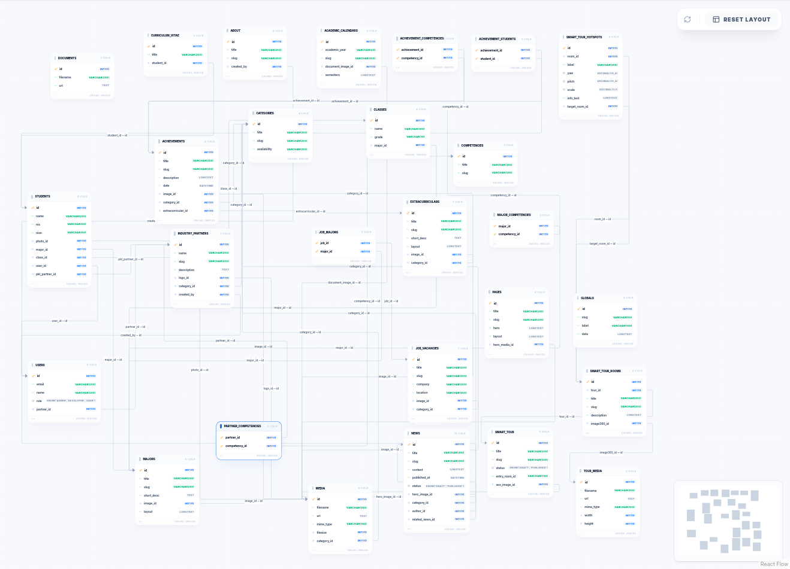

## Bagan Arsitektur Sistem

Diagram berikut menunjukkan bagaimana komponen-komponen utama sistem saling terhubung.

```
┌─────────────────────────────────────────────────────────────────┐
│                        PENGGUNA                               │
│              (Siswa, Orang Tua, Masyarakat Umum)                │
└───────────────────────────┬─────────────────────────────────────┘
                            │ HTTPS
                            ▼
┌─────────────────────────────────────────────────────────────────┐
│                    CADDY (Reverse Proxy)                        │
│                   test.smkn6malang.sch.id                       │
│              SSL/TLS • Caching • Load Balancing                 │
└───────────────────────────┬─────────────────────────────────────┘
                            │ Port 9098
                            ▼
┌─────────────────────────────────────────────────────────────────┐
│                 DOCKER CONTAINER (smk6-app)                     │
│  ┌────────────────────────────────────────────────────────────┐ │
│  │                   NEXT.JS (App Router)                     │ │
│  │                                                            │ │
│  │  ┌──────────────┐  ┌──────────────┐  ┌────────────────┐  │ │
│  │  │  (frontend)  │  │   (payload)  │  │    (tour)      │  │ │
│  │  │              │  │              │  │                │  │ │
│  │  │ • Home       │  │ • Admin UI   │  │ • Smart Tour   │  │ │
│  │  │ • Profil     │  │ • REST API   │  │   360° Viewer  │  │ │
│  │  │ • Jurusan    │  │ • GraphQL    │  │                │  │ │
│  │  │ • Berita     │  │ • Live       │  │                │  │ │
│  │  │ • Ekstra     │  │   Preview    │  │                │  │ │
│  │  │ • Lowongan   │  │              │  │                │  │ │
│  │  │ • Search     │  │              │  │                │  │ │
│  │  └──────────────┘  └──────────────┘  └────────────────┘  │ │
│  │                           │                               │ │
│  │               ┌───────────┴───────────┐                   │ │
│  │               │    PAYLOAD CMS        │                   │ │
│  │               │  (Data Engine)         │                   │ │
│  │               │  • Collections (19)    │                   │ │
│  │               │  • Globals (5)         │                   │ │
│  │               │  • Hooks & Access      │                   │ │
│  │               │  • Block Builder       │                   │ │
│  │               └───────────┬───────────┘                   │ │
│  └───────────────────────────┼───────────────────────────────┘ │
└──────────────────────────────┼──────────────────────────────────┘
                               │ TCP/IP
                               ▼
┌─────────────────────────────────────────────────────────────────┐
│                    PostgreSQL Database                          │
│                                                                 │
│   ┌─────────┐ ┌──────────┐ ┌───────────┐ ┌──────────────────┐ │
│   │ users   │ │  pages   │ │   news    │ │    majors        │ │
│   │ media   │ │  about   │ │ categories│ │  extracurriculars│ │
│   │ classes │ │ students │ │achievements│ │  industry_partners│ │
│   │   ...   │ │   ...    │ │    ...    │ │       ...        │ │
│   └─────────┘ └──────────┘ └───────────┘ └──────────────────┘ │
│                                                                 │
│               Total: ±186 tabel (termasuk                       │
│               system, versions, relations)                      │
└─────────────────────────────────────────────────────────────────┘
```

### Penjelasan Alur

1. **Pengguna** mengakses website melalui browser via `https://test.smkn6malang.sch.id`
2. **Caddy** (reverse proxy) meneruskan request ke container Docker
3. **Next.js** memproses request berdasarkan route group:
   - `(frontend)` — Halaman publik (berita, jurusan, profil, dsb.)
   - `(payload)` — Admin panel CMS & API
   - `(tour)` — Smart Tour 360° (fullscreen, tanpa header/footer)
4. **Payload CMS** mengelola 19 collection dan 5 global config
5. **PostgreSQL** menyimpan seluruh data dalam ±186 tabel (termasuk tabel sistem Payload, versioning, dan relasi)

---

## Skema Database (ERD Sederhana)

Sistem database sebenarnya memiliki **±186 tabel** yang dihasilkan oleh Payload CMS secara otomatis. Namun, secara konseptual tabel-tabel tersebut dapat disederhanakan menjadi **19 koleksi utama** dan **5 konfigurasi global**.



### Koleksi Utama

| Grup | Koleksi | Deskripsi |
|------|---------|-----------|
| **Konten** | Pages | Halaman CMS dinamis (home, profil, dll) |
| | News | Berita & artikel termasuk PKL |
| | Majors | 10 Kompetensi Keahlian |
| | Extracurriculars | Kegiatan ekstrakurikuler |
| **Profil Sekolah** | About | Profil, visi-misi, sejarah |
| | Achievements | Prestasi siswa & guru |
| | AcademicCalendars | Kalender akademik |
| **Kesiswaan** | Students | Data siswa |
| | Classes | Kelas (XII RPL 1, dll) |
| | CurriculumVitae | CV siswa |
| **Hubungan Industri** | IndustryPartners | Mitra industri (DUDI) |
| | JobVacancies | Bursa kerja khusus |
| **Referensi** | Categories | Kategori multi-purpose |
| | Competencies | Kompetensi keahlian |
| **Aset** | Media | Upload gambar/file |
| | TourMedia | Foto panorama 360° |
| | Documents | Dokumen resmi |
| **Smart Tour** | SmartTour | Virtual tour 360° |
| **Pengguna** | Users | Akun admin & developer |

### Relasi Antar Koleksi

```
    ┌──────────┐        ┌───────────────┐        ┌──────────────┐
    │Categories├────────┤     News      ├────────┤    Users     │
    └────┬─────┘        └──┬─────┬──────┘        └──────┬───────┘
         │                 │     │                      │
         │            ┌────┘     └────┐                 │
         │            ▼               ▼                 │
    ┌────┴─────┐  ┌───────┐    ┌───────────┐     ┌─────┴──────┐
    │Achievemts├──┤ Media │    │  Majors   │     │  Students  │
    └────┬─────┘  └───┬───┘    └─────┬─────┘     └──┬──┬──┬───┘
         │            │              │               │  │  │
         │            │         ┌────┴────┐          │  │  │
         │            │         │Competcies│          │  │  │
         │            │         └────┬────┘          │  │  │
         │            │              │               │  │  │
    ┌────┴────────┐   │    ┌────────┴──────┐   ┌───┘  │  └───┐
    │Extracurriclr│   │    │IndustryPartnrs│   │      │      │
    └─────────────┘   │    └───────────────┘   │   ┌──┴──┐   │
                      │                        │   │Class│   │
                 ┌────┴────┐             ┌─────┘   └─────┘   │
                 │TourMedia│             │                ┌───┴──┐
                 └────┬────┘          ┌──┴──────┐         │  CV  │
                      │               │JobVacncy│         └──────┘
                 ┌────┴────┐          └─────────┘
                 │SmartTour│
                 └─────────┘
```

### Konfigurasi Global

| Global | Fungsi |
|--------|--------|
| **Header** | Navigasi utama website |
| **Footer** | Footer website |
| **NewsTemplate** | Template layout halaman berita |
| **NewsIndexTemplate** | Template layout arsip berita |
| **JobTemplate** | Template layout halaman lowongan |

:::note[Catatan ERD]
ERD lengkap dalam format database MySQL tersedia di `modul/erd_temp.sql`. Database `erd_temp` berisi 27 tabel yang merepresentasikan 19 koleksi + tabel pivot relasi many-to-many. Database asli (PostgreSQL) memiliki ±186 tabel karena Payload CMS secara otomatis membuat tabel tambahan untuk versioning, block data, locale, dan relasi internal.
:::

---

## Arsitektur Smart Tour 360°

Smart Tour adalah fitur khusus yang memiliki arsitektur tersendiri:

```
┌─────────────────────────────────────────────────┐
│              🗺️ Smart Tour Document               │
│                                                 │
│  ┌────────┐  ┌────────┐  ┌────────┐            │
│  │ Room 1 │  │ Room 2 │  │ Room 3 │  ...       │
│  │ (Entry)│  │        │  │        │            │
│  └──┬──┬──┘  └──┬─────┘  └──┬─────┘            │
│     │  │        │            │                  │
│  ┌──┘  └────────┼────────────┘                  │
│  │              │                               │
│  ▼              ▼                               │
│  ┌─────────────────────────┐                    │
│  │  Hotspots per Room      │                    │
│  │                         │                    │
│  │  🔗 Navigation Hotspot  │──→ Room lain       │
│  │     (yaw, pitch, scale) │                    │
│  │                         │                    │
│  │  ℹ️ Info Hotspot         │──→ Popup richtext  │
│  │     (yaw, pitch, scale) │                    │
│  └─────────────────────────┘                    │
│                                                 │
│  📸 Setiap Room ──→ TourMedia (foto 360°)       │
│  ⚙️ Settings    ──→ Entry Room (room pertama)   │
└─────────────────────────────────────────────────┘
```

**Cara kerja**: Pengguna memasuki tour dari *Entry Room*, lalu berpindah antar ruangan melalui *Navigation Hotspot* yang berupa panah interaktif di dalam panorama 360°. Setiap hotspot juga bisa menampilkan informasi detail dalam format popup.
